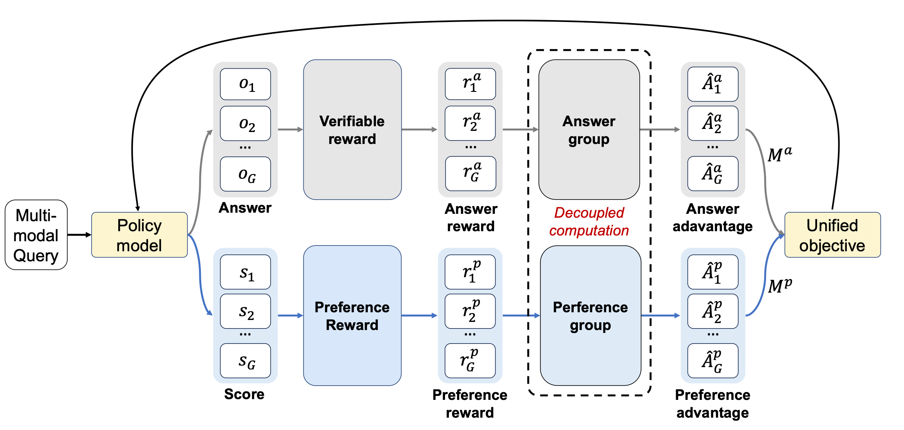

<div align="center">

# Unified Generation and Self-Verification for Vision-Language Models via Advantage Decoupled Preference Optimization

[](https://arxiv.org/abs/2601.01483)
</div>

## 📖 Overview
ADPO is a unified reinforcement learning framework that jointly optimizes answer generation and self-verification within a single policy.

<p align="center">
  
</p>

## 📰 News

- **[2026-03-07]** We release the visual grounding code for ADPO.

<a name="quick-start"></a>
## 🚀 Quick Start

### 💻 Installation

```bash
conda create -y -n adpo python=3.11
conda activate adpo
bash setup.sh
```

<a name="dataset"></a>
## 📁 Dataset

Following [VLM-R1](https://github.com/om-ai-lab/VLM-R1), we train on the RefCOCO dataset and evaluate on the LISA-grounding dataset.

```bash
mkdir -p data/vlm-r1

# download dataset
huggingface-cli download omlab/VLM-R1 --repo-type dataset --include "train2014.zip" --local-dir data/vlm-r1
huggingface-cli download omlab/VLM-R1 --repo-type dataset --include "rec_jsons_processed.zip" --local-dir data/vlm-r1
huggingface-cli download omlab/VLM-R1 --repo-type dataset --include "lisa-test.zip" --local-dir data/vlm-r1

# unzip and organize as following
/path/to/rec_jsons_processed/refcoco_train.jsonl
/path/to/rec_jsons_processed/refcocop_train.jsonl
/path/to/rec_jsons_processed/refcocog_train.jsonl
```

<a name="training"></a>
## 🚀 Training

> We recommend at least **8 × 80 GB GPUs** (e.g. A100 / H100) for training.

```bash
export DATA_PATHS="/path/to/refcoco_train.jsonl:/path/to/refcocop_train.jsonl:/path/to/refcocog_train.jsonl"
export IMAGE_FOLDERS="/path/to/coco:/path/to/coco:/path/to/coco"
export MODEL_PATH="Qwen/Qwen2.5-VL-7B-Instruct"
export NPROC=8  # number of GPUs per node

bash train.sh
```

<a name="evaluation"></a>
## 📊 Evaluation

```bash
export DATA_ROOT="/path/to/lisa"       # directory containing lisa_test.json
export IMAGE_ROOT="/path/to/lisa"      # directory containing the LISA images
export MODEL_PATH="/path/to/checkpoint"
export TEST_DATASET="lisa_test"        # evaluates DATA_ROOT/lisa_test.json
export N_SAMPLE=8                      # number of samples per question for best-of-N evaluation
export PREDICTIONS_BASE_DIR=""	       # output directory for per-GPU prediction files

bash eval.sh
```

Merged results are written to `${PREDICTIONS_BASE_DIR}/` and a summary log is saved under `logs/`.

<a name="citation"></a>
## 📚 Citation

```bibtex
@misc{qiu2026unifiedgenerationselfverificationvisionlanguage,
      title={Unified Generation and Self-Verification for Vision-Language Models via Advantage Decoupled Preference Optimization},
      author={Xinyu Qiu and Heng Jia and Zhengwen Zeng and Shuheng Shen and Changhua Meng and Yi Yang and Linchao Zhu},
      year={2026},
      eprint={2601.01483},
      archivePrefix={arXiv},
      primaryClass={cs.CV},
      url={https://arxiv.org/abs/2601.01483},
}
```

<a name="acknowledgements"></a>
## 🙏 Acknowledgements

This repository builds on and benefits from several excellent open-source projects and resources, including [VLM-R1](https://github.com/om-ai-lab/VLM-R1), [Qwen2.5-VL](https://github.com/QwenLM/Qwen2.5-VL), [RefCOCO](https://github.com/lichengunc/refer), and [LISA](https://github.com/dvlab-research/LISA).
